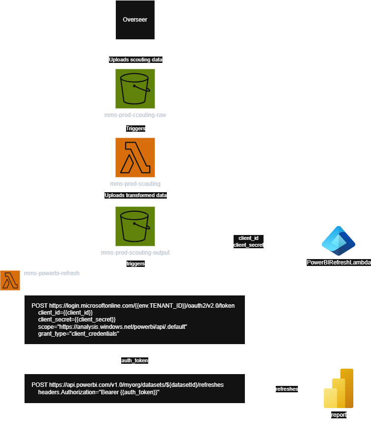

# PowerBI Auto Refresh

This terraform module is an optional add-on to the `scouting` module. The purpose of this is to automatically trigger a [PowerBI](https://learn.microsoft.com/en-us/power-bi/fundamentals/power-bi-overview) dataset refresh whenever scouting data is uploaded to S3.

### Architecture

